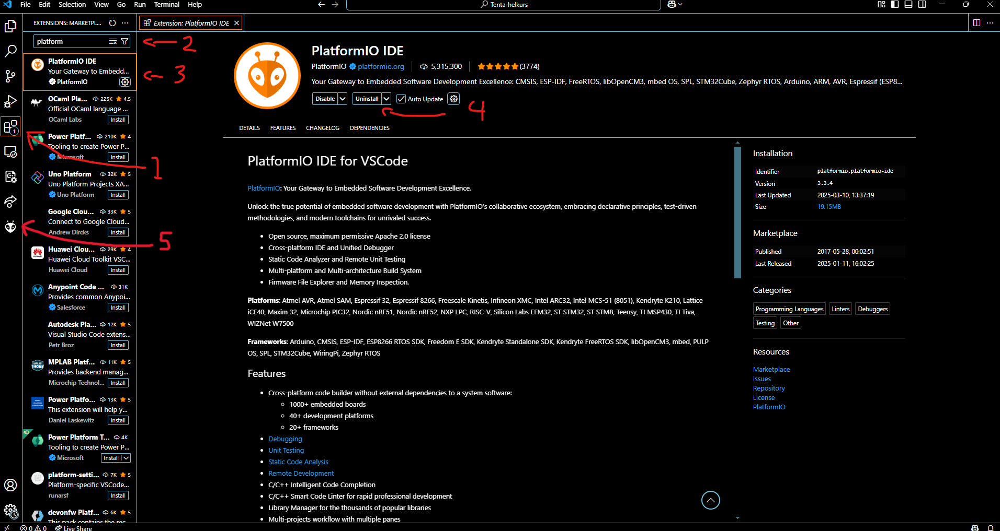
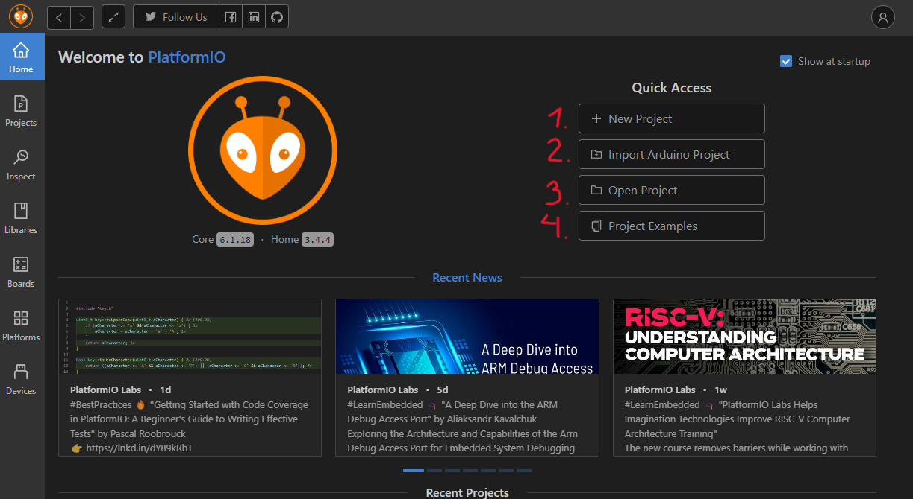
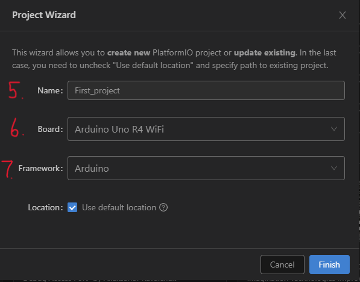
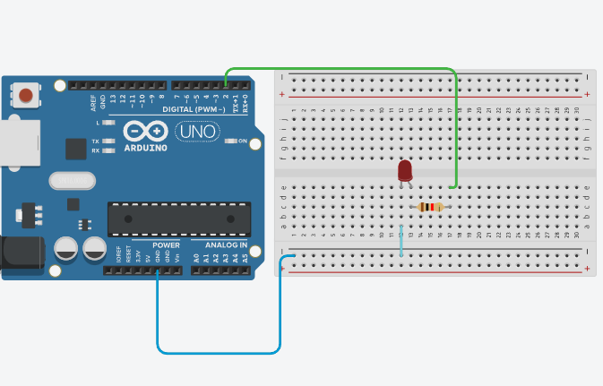
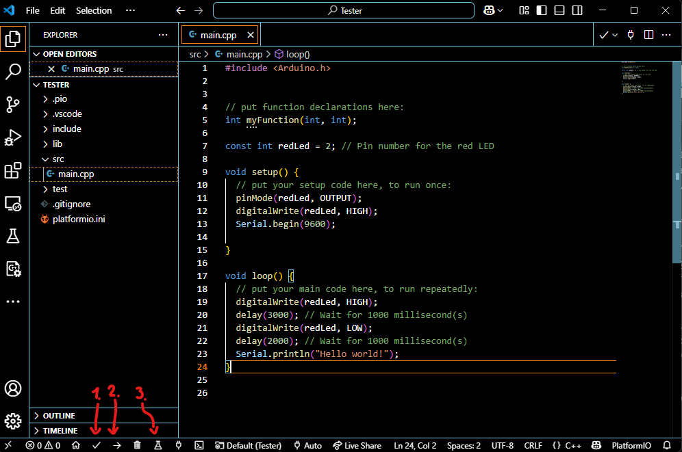

# Download guide and user manual for PlatformIO
A quick step-by-step for installing and using PlatformIO
## Why?
When deciding between using Arduino’s own IDE or choosing an extension depends on the size of your project and the scalability. The power of PlatformIO is mainly in its feature-rich environment and that it supports a wider range of microcontroller platforms and boards. 
## Choose the setup:
First you need to know how you want to interact with it, do you want to use an IDE (integrated development environment) or not.
- Method 1: PlatformIO core (Command Line Only).
- Method 2: Extension in Virtual Studio Code (Recommended).
## Quick installation guide for VS code:
- Step 1: Go to the download page for VS code: [Download VS Code](https://code.visualstudio.com/download) 
- Step 2: Choose your desired operating system.
- Step 3: Click on the user installer and follow the instructions.
- Extra: When using the IDE, download appropriate extension for the project, an important extension is the C++ extension for writing and debugging in platformIO and the python extension to use scripts or CLI.
## Installation:
This user manual covers the installation and interaction via the IDE specifically the Visual Studio Code, but a link to install and use the core version is below.
- PlatformIO core: [Download PlatformIO Core](https://platformio.org/install/cli) 

## In VS code use this step-by-step to install the PlatformIO extension:

- Step 1: Open VS Code Extension.
- Step 2: In the search bar enter “Platform”.
- Step 3: Look for the extension that says “PlatformIO IDE”.
- Step 4: Click on the install button.
- After installation reload or manually restart the VS code to ensure that everything starts up normally.
- If the installation is successful, an icon should appear that looks like the icon that number 5 is pointing at.

## Quick and easy guide for starting a project

 1. Creating a brand-new project
 2. Importing an arduino project that's already been made in Arduino IDE
 3. Open an already existent PlatformIO project
 4. Open a pre-made PlatformIO example (good for learning)

- For our first project we will click on "New Project"

---

 5. Select a name for your project
 6. Select or search for the board that you will be using  
 7. Don't change the framework for this example

## Code
For this example we will need:
| Amount | Description |
|--------|-------------|
| 1x     | Microcontroller| (We are using a R4 Wi-Fi)
| 1x     | breadboard |
| 1x     | LED|
| 1x     | resistor (500 ohm)|
| 3x     | Jumper wires|

In the example below we are using a Arduino UNO

#### Once everything is connected, we will start adding code to the project, we will use the main.cpp file that was created under the source code file (src) like in the picture below

---

- First we will tell the program what pin we will be using in the “pinMode”. We have predefined that pin 2 will be named redLed for easier use and visual representation in the code. If we were to change the pin we only have to change on one line of code. 
- In digitalWrite we will tell the redLed to turn on using the statement “HIGH” and turn it off by using "LOW".
- Serial.begin(9600) starts the serial monitor so we can write things during the loop or setup. This can be used for debugging or to displaying important information to the user. The numbers in thhe parentheses sets the baud rate. It's default value is often 9600 and is used for simple serial communication.
- In the first part of the loop, the LED will turn on for three seconds represented by the “Delay(3000)” and the delay uses millisecond in the parentheses.
- In the second part it will be turned off for 2 seconds.
- On the last line, it will display “Hello World!” in the serial monitor.

### Now we will compile, send the code to the board and then open the serial monitor

1. Compiles your code.
2. Uploads the compiled firmware to your board.
3. Opens the serial monitor

### Congratulations
Now have you installed, started and made a simple project using PlatformIO

### Extra
For more information use the link below for further information and more advance understanding
[Quick guide for PlatformIO](https://docs.platformio.org/en/latest/integration/ide/pioide.html) 

